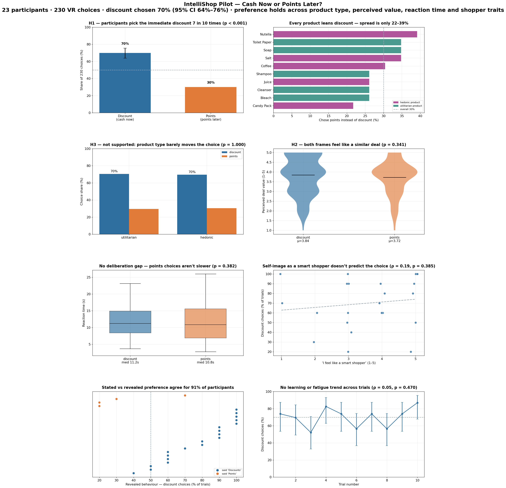

# IntelliShop Pilot Study – Data Analysis

This repository contains the data analysis materials for the IntelliShop pilot study.

It is separated from the Unity project repository in order to keep the analytical workflow organized and to avoid mixing experimental application files with statistical analysis files.

## Repository Contents

The repository includes:

- `merged_data.csv`  
  The final merged dataset used for statistical analysis.

- `IntelliShop_DataAnalysis.ipynb`  
  Jupyter Notebook containing the data analysis workflow, including data preparation steps, descriptive statistics, and visualizations.

- `analysis/insights_dashboard.py`  
  Reproducible script that turns `merged_data.csv` into the figures in `figures/`
  and the written summary in `INSIGHTS.md`, with the statistical test behind each
  hypothesis. Run with `python analysis/insights_dashboard.py`.

- `figures/`, `INSIGHTS.md`  
  Auto-generated dashboard, per-question panels, and the insights write-up.

## Key Findings

**Shoppers overwhelmingly take the immediate discount over equivalent loyalty
points — 70% of 230 choices (95% CI 64–76%, binomial p < 0.001).** The preference
behaves like a broad heuristic rather than a considered trade-off:

| Question | Finding | Test |
|---|---|---|
| **H1** Do people prefer the immediate discount? | **Yes** — 70% discount vs 30% points | binomial, p < 0.001 |
| **H2** Is one frame seen as a better deal? | **No** — mean rating 3.84 vs 3.72 | Mann–Whitney, p = 0.34 |
| **H3** Does it depend on product type (hedonic vs utilitarian)? | **No** — 70% vs 70% discount | χ², p = 1.0 |
| Are points choices more deliberated? | **No** — median 11.2 s vs 10.8 s | Mann–Whitney, p = 0.38 |
| Does "smart shopper" self-image predict the choice? | **No** — ρ = 0.19 | Spearman, p = 0.39 |
| Any learning / fatigue across trials? | **No** — flat discount share | Spearman, p = 0.47 |

Nuances worth noting:

- **Large individual differences.** Participant discount rates span 20–100%;
  ~1 in 4 participants reliably prefer points. See
  `figures/08_participant_heatmap.png`.
- **Stated ≈ revealed preference.** Self-reported preference matches actual
  behaviour for 91% of participants.
- **Design implication.** A points reward described as "worth the same as €X off"
  is under-valued at the point of choice (~2:1 rejection). To compete it likely
  needs a visible premium over face value, or targeting the points-leaning
  segment specifically.

Full write-up with all effect sizes and limitations: [`INSIGHTS.md`](INSIGHTS.md).
Individual panels are in [`figures/`](figures/).

## Data Overview

The original study data consisted of multiple sources:

1. **Raw VR behavioral data**  
   Exported from the Meta Quest 3 headset, including participant session data such as trial number, product name, selected frame, reaction time, and deal value rating.

2. **Raw survey data**  
   Exported from the survey platform, including demographics, manipulation checks, smart shopper scale items, and additional attitudinal measures.

3. **Cleaned survey data**  
   A processed version of the survey data with incomplete responses removed, failed attention checks excluded, Likert scales recoded, and variable names standardized.

4. **Merged dataset**  
   The final dataset was created by merging the cleaned survey data with VR behavioral data using participant ID.

## Shared Data and Privacy

To protect participant privacy, this repository only includes:

- `merged_data.csv`

The raw VR files, raw survey responses, and intermediate cleaned survey files are **not shared in this repository**, as they may contain personal or potentially identifiable participant information.

This repository is therefore intended to provide only the analysis-ready dataset required to reproduce the reported results, while following data minimization and privacy protection principles.

## Purpose of `merged_data.csv`

`merged_data.csv` serves as the final dataset used for the statistical analysis in this project. It combines:

- cleaned survey responses
- behavioral VR data

This file is the only dataset required to run the analysis notebook included in this repository.

## Reproducibility

All results reported in the analysis were generated from `merged_data.csv` using:

- `IntelliShop_DataAnalysis.ipynb`

## Note

This repository contains only the data analysis component of the IntelliShop pilot study.

The Unity project, experimental application, and other implementation-related files are maintained in a separate repository.
